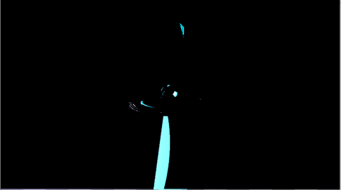

# GrAbility  

# 操作説明

# 担当ソースコード

## 好村

## 豊岡 大

- LockOn.cpp(一部)  
  (LockOn処理部分を担当)  
- LockOn.h(一部)  
  (LockOn処理に必要な変数を追加)  
- Bloom.cpp
- Bloom.h  
- FontRender.cpp  
- FontRender.h  
- IRenderer.h  
- ModelRender.cpp  
- ModelRender.h  
- PhysicsStaticBox.cpp  
- PhysicsStaticBox.h  
- PostEffect.cpp  
- PostEffect.h  
- RenderingEngine.cpp  
- RenderingEngine.h  
- SceneLight.cpp  
- SceneLight.h  
- SerialNumberSpriteRender.cpp  
- SerialNumberSpriteRender.cpp  
- ShadowMapRender.cpp  
- ShadowMapRender.h  
- SpringCamera.cpp  
- SpringCamera.h  
- SpriteRender.cpp  
- SpriteRender.h  
- LevelRender.cpp  
- LevelRender.h  
- MapChipRender.cpp  
- MapChipRender.h  
- Level2DRender.cpp  
- Level2DRender.h  
- MapChip2DRender.cpp  
- MapChip2DRender.h  

# 改造したエンジンのコード

## 好村

## 豊岡 大
- MeshParts.cpp、MeshParts.h  
  速度マップ描画用の定数バッファ追加。
- Model.cpp、Model.h  
  速度マップ描画用の定数バッファを更新する処理追加。

# 川瀬式ブルーム

通常シーンをオフスクリーンレンダリング後、輝度抽出を行い、
ガウシアンブラーとダウンサンプリングを繰り返して複数枚のテクスチャを作成して、  
複数枚のテクスチャの平均を取って加算合成することで  
光のあふれを表現できるようになっています。
通常シーン  

輝度抽出  

ガウシアンブラーとダウンサンプリング（これを複数回繰り返す）  

加算合成後

