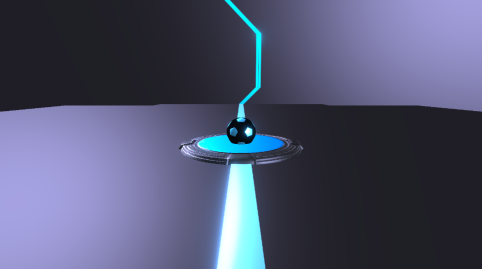
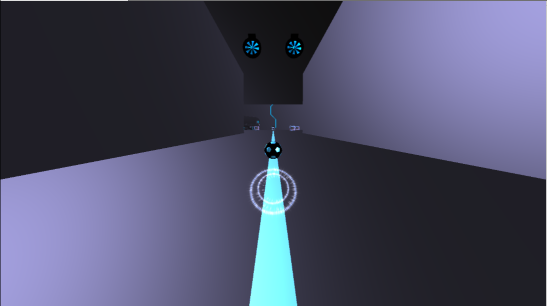
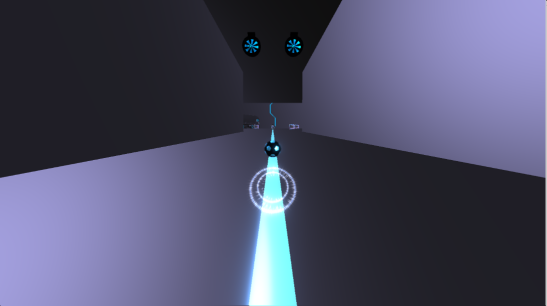

# GrAbility  

河原電子ビジネス専門学校  
ゲームクリエイター科2年 豊岡 大  

河原電子ビジネス専門学校  
ゲームクリエイター科2年 好村 雄真  
# 目次

1. [作品概要](#anchor1)  
2. [操作説明](#anchor2)  
3. [担当ソースコード](#anchor3)  
   1. [好村 雄真](#anchor3-1)  
   2. [豊岡 大](#anchor3-2)  
1. [改造したエンジンのコード](#anchor4)  
2. [川瀬式ブルーム](#anchor5)  
3. [モーションブラー](#anchor6)  
4. [コライダー](#anchor7)  

# 作品概要

- GrAbility(グラビリティ)  
三人称視点でボールを弾くように動かして時間切れになる前に  
ゴールを目指すミニゲームです。  

**紹介動画**
<iframe width="560" height="315" src="https://youtu.be/JfZP9xSGWfo" frameborder="0" allow="accelerometer; autoplay; clipboard-write; encrypted-media; gyroscope; picture-in-picture" loading="lazy" allowfullscreen></iframe>

- **使用ゲームエンジン**  
学校内製エンジン(DirectX12)を改造して制作  

- **使用ツール**  
Visual Studio 2022  
3ds Max 2022  
Adobe Photoshop Elements 2021  
Git Hub  

- **使用言語**  
C++  
HLSL  

- **開発環境**  
Windows10  
DirectX12  

- **制作人数**  
4人  

- **開発期間**  
2022年2月～2021年8月

# 操作説明

# 担当ソースコード

## 好村 雄真

- SpriteRender.h(一部)  
  (画像の切り取り処理を行う関数の追加)
- PowerCharge.cpp
- PowerCharge.h
- LockOn.cpp
- LockOn.h
- BreakBox.cpp
- BreakBox.h
- Bumper.cpp
- Bumper.h
- Door.cpp
- Door.h
- Drone.cpp
- Drone.h
- Duct.cpp
- Duct.h
- Energy.cpp
- Energy.h
- Engine.cpp
- Engine.h
- Goal.cpp
- Goal.h
- HoneyCombBlock.cpp
- HoneyCombBlock.h
- JumpBoard.cpp
- JumpBoard.h
- Nut.cpp
- Nut.h
- Pipe.cpp
- Pipe.h
- ReSpawnPoint.cpp
- ReSpawnPoint.h
- SignBoard.cpp
- SignBoard.h
- SpeedUpRail.cpp
- SpeedUpRail.h
- Truck.cpp
- Truck.h
- Turret.cpp
- Turret.h
- Volt.cpp
- Volt.h
- Stage_1.cpp
- Stage_1.h
- Stage_1_Stage.cpp
- Stage_1_Stage.h
- Stage_1_Wall.cpp
- Stage_1_Wall.h
- ChargeShot.cpp
- ChargeShot.h
- Length.cpp
- Length.h
- TimeLimit.cpp
- TimeLimit.h
- Window.cpp
- Window.h
- First.cpp
- First.h
- Game.cpp
- Game.h
- GameClear.cpp
- GameClear.h
- GameOver.cpp
- GameOver.h
- Setting.cpp
- Setting.h
- Title.cpp
- title.h
- GameLight.cpp
- GameLight.h
- Player.cpp
- Player.h
- LockOnObject.cpp
- LockOnObject.h

## 豊岡 大

- LockOn.cpp(一部)  
  (LockOn処理部分を担当)  
- LockOn.h(一部)  
  (LockOn処理に必要な変数を追加)  
- Bloom.cpp
- Bloom.h  
- FontRender.cpp  
- FontRender.h  
- IRenderer.h  
- ModelRender.cpp  
- ModelRender.h  
- PhysicsStaticBox.cpp  
- PhysicsStaticBox.h  
- PostEffect.cpp  
- PostEffect.h  
- RenderingEngine.cpp  
- RenderingEngine.h  
- SceneLight.cpp  
- SceneLight.h  
- SerialNumberSpriteRender.cpp  
- SerialNumberSpriteRender.cpp  
- ShadowMapRender.cpp  
- ShadowMapRender.h  
- SpringCamera.cpp  
- SpringCamera.h  
- SpriteRender.cpp  
- SpriteRender.h  
- LevelRender.cpp  
- LevelRender.h  
- MapChipRender.cpp  
- MapChipRender.h  
- Level2DRender.cpp  
- Level2DRender.h  
- MapChip2DRender.cpp  
- MapChip2DRender.h  

# 改造したエンジンのコード

## 豊岡 大

- MeshParts.cpp、MeshParts.h  
  速度マップ描画用の定数バッファ追加。
- Model.cpp、Model.h  
  速度マップ描画用の定数バッファを更新する処理追加。

# 川瀬式ブルーム

通常シーンをオフスクリーンレンダリング後、輝度抽出を行い、
ガウシアンブラーとダウンサンプリングを繰り返して複数枚のテクスチャを作成して、  
複数枚のテクスチャの平均を取って加算合成することで光のあふれを表現できるようになっています。  
**通常シーン**  
  
**輝度抽出**  
  
**ガウシアンブラーとダウンサンプリング（これを複数回繰り返す）**  
  
**加算合成後**  
  

# モーションブラー

現在のモデルの位置と１フレーム前のモデルの位置から
そのピクセルの移動速度を計算、速度マップを描画。  
その速度マップを使用して通常シーンを速度方向にずらして複数回サンプリングして平均を取ってそのテクスチャを加算合成することで  
残像のようなポストエフェクトを表現しています。  
**通常シーン**  
  
**速度マップ**  
  
**加算合成後**  
  

# コライダー

プレイヤーが高速で移動してオブジェクトを壊して爽快感を感じてもらえるようなゲームをコンセプトとして制作していると  
どうしても速度が速くなりすぎてコライダーを貫通してしまう問題が多発したので、衝突判定を240fpsにしました。  
モデルのメッシュからコライダーを生成していたことで、四角形のモデルでも三角ポリゴン化されている影響で斜めの線が入ってしまい  
そこからボールが貫通してしまうので3dsMax上で配置したボックスの位置を元にボックスコライダーを生成するようにすることで、  
ボールがステージを貫通してしまうことを防げるようになりました。
